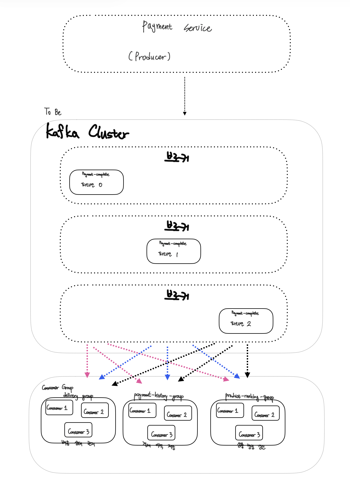
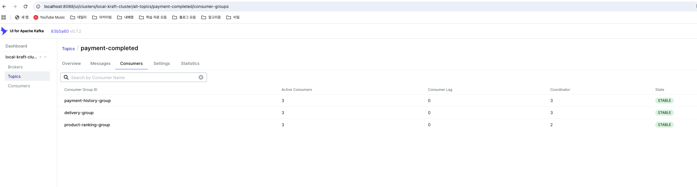

# Kafka 메시지 처리 구조 개선

## ✅ 실습 개요

본 실습은 **Kafka의 메시지 처리 메커니즘**을 이해하고,  
기존 메시지 처리 구조의 한계를 분석한 뒤  
**더 효율적인 메시지 처리 구조로 개선하는 것**을 목표로 한다.

챕터 4-3에서 구현한 `PaymentCompletedEvent` 기반 구조는  
기능적으로는 정상 동작하지만,  
대규모 트래픽 환경을 고려했을 때 메시지 처리 구조 측면에서 비효율적인 부분이 존재한다.

본 README에서는  
1️⃣ 기존 메시지 처리 구조를 분석하고  
2️⃣ 병목 지점을 도식화하여 설명한다.

## 1. 기존 메시지 처리 구조 분석

### 1-1. Kafka 클러스터 구성

- **Kafka Broker**: 3개
- **Topic**: `payment-completed` (1개)
- **Partition**: 3개
- **Consumer Group**: 3개
    - `delivery-group`
    - `payment-history-group`
    - `product-ranking-group`

각 파티션은 서로 다른 브로커에 분산 저장되어 있다.

### 1-2. 기존 메시지 처리 구조 도식

#### 구조 설명
- `payment-completed` 단일 토픽을 사용
- 토픽은 3개의 파티션으로 구성되어 있으며, 브로커 3개에 분산됨
- 하나의 토픽을 **3개의 Consumer Group이 동시에 구독**
- 각 Consumer Group 내부에는 **Consumer 인스턴스가 1개만 존재**
- 따라서 각 Consumer는 **모든 파티션을 순차적으로 소비**

### 기존 구조의 병목 지점

#### 파티션 기반의 Consumer 병렬 처리 미활용
- 파티션은 3개로 구성되어 있으나 각 컨슈머 그룹에 컨슈머가 1개만 존재
- 결과적으로 파티션 기반 병렬 처리가 이루어지지 않고 모든 메시지가 단일 컨슈머에서 순차적으로 처리된다.

#### DB 중심 동기 처리 구조
- 메시지 소비 이후 처리 로직이 JPA에 의존
- DB 조회, 업데이트 트랜잭션 커밋이 완료된 이후 다음 작업을 처리할 수 있게 됨

### 2. 효율적인  메시지 처리 구조 설계하기

#### 2-1. 파티션 기반 병렬 처리 활성화
- 기존 구조에서는 토픽의 파티션 수는 3개였으나, 컨슈머 그룹 내 컨슈머가 1개만 실행되어 병렬 처리가 이루어지지 않음
- 이를 개선하기 위해 각 Consumer Group 당 Consumer 인스턴스를 맞춰 메시지를 소비할 수 있도록 함
- As is : Consumer 인스턴스 각 1 -> To be : Consumer 인스턴스 각 3

### 왜 병렬처리로 변경하였을 때 더 효율적인가
- 기존에는 하나의 컨슈머 인스턴스가 모든 파티션을 처리하여 메시지가 순차적으로 처리되었으나, 
- concurrency를 3으로 설정하여 동일 그룹 내 컨슈머 인스턴스를 3개로 확장함으로서 각 컨슈머가 하나의 파티션을 전담하도록 개선하였다
- 파티션 단위 병렬 처리가 가능해져 처리량이 증가하고, 트래픽 증가 시 발생할 수 있는 문제를 완화할 수 있다.
